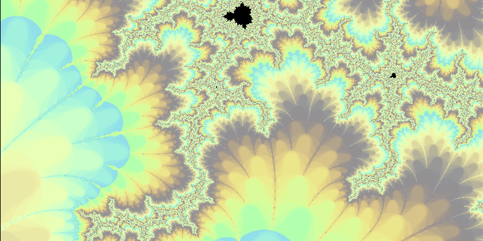
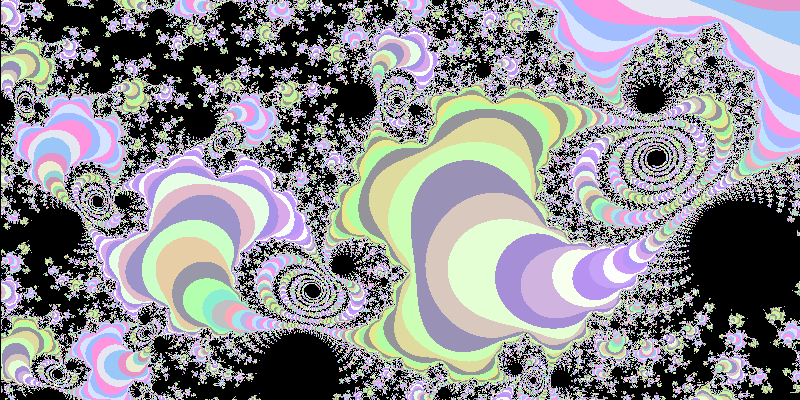
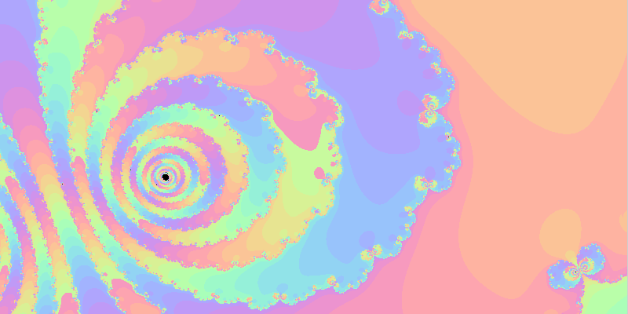

# fractol
#### Fractal renderer using minilibx  
<code>Usage: fractol [multi] \<set\></code>  
  where <code>\<set\></code>  is one of <code>mandelbrot | burning-ship | tricorn</code>  
  Including <code>multi</code> flag enables adjusting the power to which the fractal is calculated. This creates the 'multibrot' variants of normal sets.  
  All fractal sets can be switched to their corresponding Julia sets, where the set is calculated for the current coordinates of the cursor.  
 

